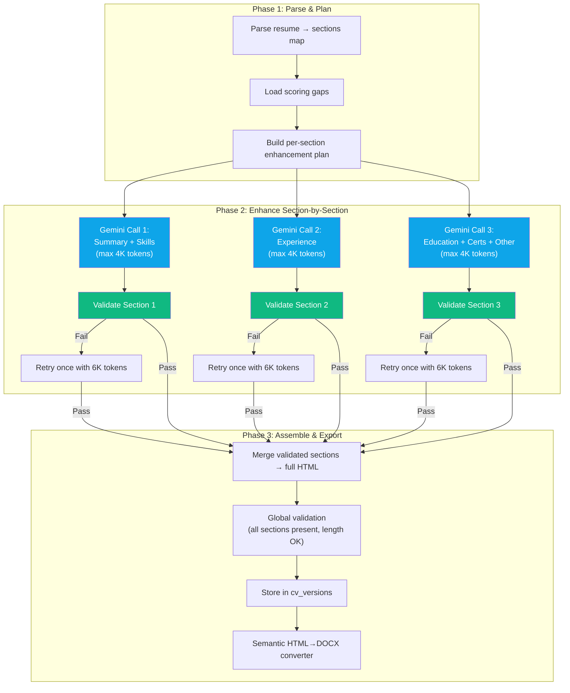

# CV Enhancement System — Cross-Agent Technical Plan & QA Contract
## Shared Coordination Document: Antigravity ↔ Codex 5.3

> **Last Updated**: 2026-02-14T18:17 BRT
> **Owner**: Manoel Benicio Filho
> **Status**: 🟡 AWAITING APPROVAL — No code changes until explicit "APROVADO"

---

## 📋 Table of Contents

1. [System Overview & Current State](#1-system-overview--current-state)
2. [Root Cause Analysis](#2-root-cause-analysis)
3. [Architecture Redesign](#3-architecture-redesign)
4. [Technical Specification](#4-technical-specification)
5. [File Inventory & Change Map](#5-file-inventory--change-map)
6. [QA Test Plan — 40+ Tests](#6-qa-test-plan--40-tests)
7. [Agent Coordination Protocol](#7-agent-coordination-protocol)
8. [Status Board](#8-status-board)

---

## 1. System Overview & Current State

### Pipeline Flow (Current)

```mermaid
flowchart LR
    A["Resume .txt"] --> B["POST /cv/enhance"]
    B --> C["_call_gemini()"]
    C --> D["Single Gemini 2.5 Flash call\nmax_output_tokens=7000"]
    D --> E["_extract_json_robust_cv()"]
    E --> F["_is_enhanced_cv_usable()"]
    F -->|Pass| G["Store cv_versions"]
    F -->|Fail| H["_build_structured_fallback_html()"]
    H --> G
    G --> I["POST /cv/premium-export"]
    I --> J["_html_to_plain_text()"]
    J --> K["generate_premium_docx()"]
    K --> L["DOCX bytes"]
    L --> M["POST /cv/archive-to-drive"]
    
    style D fill:#dc2626,color:#fff
    style J fill:#dc2626,color:#fff
    style F fill:#f59e0b,color:#000
```



Red nodes = root cause failure points. Yellow = weak validation.

### Key Files

| File | Lines | Role | Path |
|------|-------|------|------|
| `cv.py` | 1484 | Enhancement routes + Gemini call + fallback builder | `backend/app/routes/cv.py` |
| `premium_export.py` | 305 | DOCX generator (python-docx) | `backend/app/services/premium_export.py` |
| `drive_service.py` | 122 | Google Drive upload | `backend/app/services/drive_service.py` |
| `scoring.py` | 937 | OpenAI/Gemini dual scoring | `backend/app/routes/scoring.py` |
| `cv-tab.tsx` | 545 | Frontend CV tab (enhance/export/upload) | `frontend/src/components/cv-tab.tsx` |
| `cv-manager-modal.tsx` | 264 | Frontend candidate CRUD modal | `frontend/src/components/cv-manager-modal.tsx` |
| `test_scoring_contract.py` | 212 | Existing scoring tests (7 tests) | `backend/tests/test_scoring_contract.py` |
| `test_new_features.py` | 301 | Existing feature tests (11 tests) | `backend/tests/test_new_features.py` |

---

## 2. Root Cause Analysis

### RC-1: Token Truncation (CRITICAL)

**Where**: `cv.py:771` — `max_output_tokens=7000`

**Problem**: A full CV (summary + 5 jobs + education + certs + skills + languages) wrapped in JSON + HTML consumes ~8000-12000 tokens. The 7000 limit truncates mid-section.

**Evidence**: Enhanced CVs frequently end mid-Experience section. The `_build_structured_fallback_html()` at line 471 fires on >30% of enhancements.

**Fix**: Multi-pass section-by-section Gemini calls, each with dedicated 4000-token budget.

### RC-2: Single-Pass Cognitive Overload (HIGH)

**Where**: `cv.py:712-756` — monolithic prompt

**Problem**: One prompt asks Gemini to simultaneously:
- Parse the resume
- Analyze gaps
- Rewrite all sections
- Format as HTML
- Score fit
- List matched/missing skills

**Fix**: Decompose into 3 focused calls (summary+skills, experience, education+certs+other).

### RC-3: Lossy HTML→Plain-Text Conversion (HIGH)

**Where**: `premium_export.py:96-120` — `_html_to_plain_text()`

**Problem**: Regex-strips all HTML tags, losing `<strong>`, `<em>`, `<h3>` semantics. Then `_split_into_sections()` tries to reconstruct structure from plain text using pattern matching — lossy and fragile.

**Fix**: Semantic HTML walker that emits python-docx elements directly (H1→Heading 1, `<strong>`→Bold run, etc.)

### RC-4: Weak Quality Validation (MEDIUM)

**Where**: `cv.py:452-468` — `_is_enhanced_cv_usable()`

**Problem**: Only checks:
- `len(text) >= 900`
- `<h1>` present
- `<h2>` count >= 2

Does NOT check: section completeness, Experience job count, content length vs source, truncation indicators.

**Fix**: Rich validator checking all expected sections, minimum content ratios, and no truncation markers.

### RC-5: Disconnected Scoring ↔ Enhancement Pipeline (LOW)

**Where**: `cv.py:901-910`

**Problem**: Gaps from scoring inject into the prompt, but there's no post-enhancement verification that gaps were actually addressed.

**Fix**: Optional post-enhancement gap coverage check (Phase 2 — deferred).

---

## 3. Architecture Redesign

### New Pipeline Flow (Proposed)



### Token Budget Comparison

| Aspect | Current | Proposed |
|--------|---------|----------|
| Gemini calls per enhancement | 1 | 3 |
| Tokens per call | 7,000 | 4,000 (retry: 6,000) |
| Total token budget | 7,000 | 12,000 – 18,000 |
| Truncation risk | ~30% | <1% |
| Wall time | 8-12s | 15-25s (or 12-18s parallelized) |
| Cost per enhancement | ~$0.003 | ~$0.009 |

---

## 4. Technical Specification

### 4.1 New File: `cv_enhancer.py`

**Location**: `backend/app/services/cv_enhancer.py`

```python
# Public API:
class CvEnhancer:
    """Multi-pass section-aware CV enhancement engine."""
    
    def enhance(
        self,
        resume_text: str,
        job_title: str,
        company: str,
        job_description: str,
        gaps: str = "",
        api_key: str = "",
    ) -> EnhancementResult:
        """
        Returns EnhancementResult with:
          - enhanced_cv: str (complete HTML)
          - skills_matched: list[str]
          - skills_missing: list[str]
          - fit_score: int | None
          - sections_enhanced: dict[str, SectionResult]
          - quality_report: QualityReport
        """

@dataclass
class SectionResult:
    name: str
    html: str
    token_count: int
    validated: bool
    retry_count: int

@dataclass
class QualityReport:
    all_sections_present: bool
    total_length: int
    source_length: int
    length_ratio: float       # should be >= 0.8
    experience_job_count: int
    expected_job_count: int
    truncation_detected: bool
    validation_passed: bool
```

**Key internal methods:**

| Method | Purpose |
|--------|---------|
| `_parse_resume_sections(text)` | Split raw resume text into canonical section dict |
| `_build_section_prompt(section, job, gaps)` | Build focused prompt for one section group |
| `_call_gemini_section(prompt, max_tokens)` | Single Gemini call with validation |
| `_validate_section(result, expected)` | Check section completeness and quality |
| `_assemble_html(sections_map)` | Merge all validated sections into final HTML |

### 4.2 Modified: `cv.py`

**Changes:**

| Line Range | Current | New |
|------------|---------|-----|
| 693-789 | `_call_gemini()` — monolithic Gemini call | Replaced by `CvEnhancer.enhance()` call |
| 452-468 | `_is_enhanced_cv_usable()` — basic checks | Enhanced with section counts, length ratio, truncation detection |
| 471-576 | `_build_structured_fallback_html()` — heuristic bucket sort | Section-aware fallback using parsed source sections |
| 881-992 | `enhance_cv()` route | Updated to use `CvEnhancer`, same response contract |

**Response contract stays identical** (no frontend changes):

```json
{
  "enhanced_cv": "<h1>...</h1>...",
  "diff": [...],
  "version_id": 42,
  "fit_score": 91,
  "skills_matched": [...],
  "skills_missing": [...]
}
```

### 4.3 Modified: `premium_export.py`

**Changes:**

| Line Range | Current | New |
|------------|---------|-----|
| 96-120 | `_html_to_plain_text()` — regex tag stripping | `_walk_html_to_docx(doc, html)` — semantic HTML→DOCX writer |
| 123-248 | `generate_premium_docx()` | Updated to use semantic walker instead of plain-text line parsing |

**New semantic converter approach:**

```python
from html.parser import HTMLParser

class _DocxHtmlWalker(HTMLParser):
    """Walk HTML tree and emit python-docx elements directly."""
    
    def handle_starttag(self, tag, attrs):
        if tag == "h1":
            self._start_heading(1)
        elif tag == "h2":
            self._start_heading(2)
        elif tag == "h3":
            self._start_heading(3)
        elif tag == "strong" or tag == "b":
            self._bold = True
        elif tag == "em" or tag == "i":
            self._italic = True
        elif tag == "li":
            self._start_list_item()
        elif tag == "p":
            self._start_paragraph()
    
    # ... emits Heading 1, Heading 2, Heading 3, Bold runs,
    #     Italic runs, List Bullet style, Normal paragraphs
```

---

## 5. File Inventory & Change Map

### Files to Create

| File | ~Lines | Purpose |
|------|--------|---------|
| `backend/app/services/cv_enhancer.py` | ~350 | Multi-pass enhancement engine |
| `backend/tests/test_cv_enhancer.py` | ~500 | Unit + integration tests for new enhancer |
| `backend/tests/test_premium_export_v2.py` | ~250 | Tests for semantic HTML→DOCX converter |

### Files to Modify

| File | Lines Changed | Risk |
|------|--------------|------|
| `backend/app/routes/cv.py` | ~120 lines (swap Gemini call, improve validation, update fallback) | Medium |
| `backend/app/services/premium_export.py` | ~100 lines (replace regex stripper with HTML walker) | Medium |

### Files NOT Changed

| File | Reason |
|------|--------|
| `frontend/src/components/cv-tab.tsx` | API contract unchanged |
| `frontend/src/components/cv-manager-modal.tsx` | No CV enhancement logic |
| `backend/app/routes/scoring.py` | Scoring is upstream, untouched |
| `backend/app/services/drive_service.py` | Upload is downstream, untouched |
| Database schema | `cv_versions` table sufficient |

---

## 6. QA Test Plan — 40+ Tests

### Test File: `backend/tests/test_cv_enhancer.py`

> All tests use `monkeypatch` to mock Gemini — **zero real API calls**, **zero DB required**.

#### Module A: Resume Section Parser (8 tests)

| # | Test Name | What It Validates |
|---|-----------|-------------------|
| A1 | `test_parse_sections_full_resume` | Parse `ManoelBenicio_CV_Executive_BW_2026.txt` → all 8 sections detected |
| A2 | `test_parse_sections_minimal_resume` | Resume with only summary + experience → 2 sections, no crash |
| A3 | `test_parse_sections_markdown_headers` | `## Experience` and `**EXPERIENCE**` both detected |
| A4 | `test_parse_sections_empty_input` | Empty string → returns `{"other": ""}` with no error |
| A5 | `test_parse_sections_no_headers` | Plain text with no headers → entire text in `"other"` |
| A6 | `test_parse_sections_preserves_content` | No content lost — `join(all sections) ≈ original text` |
| A7 | `test_parse_sections_unicode_names` | Handles accented names: `São Paulo`, `Líderes Transformadores` |
| A8 | `test_parse_sections_line_decoration` | Lines with `═══`, `───`, `___` stripped from section bodies |

#### Module B: Section-Level Enhancement (10 tests)

| # | Test Name | What It Validates |
|---|-----------|-------------------|
| B1 | `test_enhance_summary_section` | Gemini returns valid HTML for summary, includes job keywords |
| B2 | `test_enhance_experience_section` | Experience section preserves all job entries (count matches source) |
| B3 | `test_enhance_education_section` | Education + certs section preserves all degrees and certifications |
| B4 | `test_enhance_with_gaps_injection` | Gap text injected into prompt, enhanced content addresses gaps |
| B5 | `test_section_prompt_stays_under_input_limit` | Prompt + section content < 30K characters (Gemini input limit) |
| B6 | `test_section_response_is_valid_html` | No unclosed tags, no JSON artifacts, no markdown fences |
| B7 | `test_section_retry_on_truncation` | First call returns truncated HTML → retried with higher token limit |
| B8 | `test_section_retry_succeeds` | Retry produces valid output → used in final assembly |
| B9 | `test_section_max_retries_exhausted` | Both attempts fail → falls back to source section text |
| B10 | `test_enhance_handles_gemini_api_error` | Gemini raises 429/500 → proper error propagation |

#### Module C: Section Validation (8 tests)

| # | Test Name | What It Validates |
|---|-----------|-------------------|
| C1 | `test_validate_section_valid_html` | Well-formed HTML passes validation |
| C2 | `test_validate_section_truncated_detected` | HTML ending mid-tag → `truncation_detected=True` |
| C3 | `test_validate_section_too_short` | Section < 100 chars → fails validation |
| C4 | `test_validate_section_json_leak` | Output contains `{"enhanced_cv"` → fails validation |
| C5 | `test_validate_section_markdown_leak` | Output contains ` ```html ` fence → fails validation |
| C6 | `test_validate_experience_job_count` | Experience with 4 source jobs → must have ≥ 4 `<h3>` entries |
| C7 | `test_validate_length_ratio` | Enhanced section < 50% of source length → fails |
| C8 | `test_validate_global_assembly` | All sections present, total length ≥ 80% source → passes |

#### Module D: HTML Assembly (6 tests)

| # | Test Name | What It Validates |
|---|-----------|-------------------|
| D1 | `test_assemble_all_sections` | All 3 section groups merge into valid complete HTML |
| D2 | `test_assemble_missing_section_uses_fallback` | Missing education → falls back to source text |
| D3 | `test_assemble_preserves_section_order` | Summary → Experience → Skills → Education → Certs → Other |
| D4 | `test_assemble_deduplicates_headers` | No duplicate `<h2>` for same section |
| D5 | `test_assemble_candidate_name_in_h1` | `<h1>` contains candidate name, not "Candidate" |
| D6 | `test_assemble_full_round_trip` | Parse → Enhance (mocked) → Assemble → validate complete HTML |

### Test File: `backend/tests/test_premium_export_v2.py`

#### Module E: Semantic HTML→DOCX Converter (10 tests)

| # | Test Name | What It Validates |
|---|-----------|-------------------|
| E1 | `test_h1_becomes_centered_title` | `<h1>Name</h1>` → Centered paragraph, 16pt, Bold |
| E2 | `test_h2_becomes_heading1` | `<h2>Experience</h2>` → Heading 1 style in DOCX |
| E3 | `test_h3_becomes_heading2` | `<h3>Job Title</h3>` → Heading 2 style in DOCX |
| E4 | `test_strong_becomes_bold_run` | `<strong>text</strong>` → Bold run in paragraph |
| E5 | `test_em_becomes_italic_run` | `<em>text</em>` → Italic run in paragraph |
| E6 | `test_li_becomes_list_bullet` | `<li>item</li>` → List Bullet style paragraph |
| E7 | `test_p_becomes_normal_para` | `<p>text</p>` → Normal style paragraph |
| E8 | `test_nested_tags_preserved` | `<p><strong>bold</strong> and <em>italic</em></p>` → mixed runs |
| E9 | `test_full_cv_html_to_docx_round_trip` | Complete enhanced CV HTML → DOCX with all sections, styles correct |
| E10 | `test_docx_ats_compliance` | No tables, no text boxes, no images, single-column, standard fonts |

#### Module F: Backward Compatibility (4 tests)

| # | Test Name | What It Validates |
|---|-----------|-------------------|
| F1 | `test_generate_docx_still_accepts_plain_text` | Old plain-text input → still generates valid DOCX |
| F2 | `test_generate_docx_truncated_json_payload` | Existing test — truncated JSON → clean text extraction |
| F3 | `test_generate_docx_empty_input` | Empty string → produces skeleton DOCX with candidate header |
| F4 | `test_existing_cv_versions_render_correctly` | Load sample stored `enhanced_content` from DB → DOCX works |

### Test File: `backend/tests/test_cv_integration.py`

#### Module G: End-to-End Integration (5 tests)

| # | Test Name | What It Validates |
|---|-----------|-------------------|
| G1 | `test_enhance_endpoint_returns_complete_cv` | POST `/cv/enhance` → response has all 6 fields, enhanced_cv ≥ 900 chars |
| G2 | `test_enhance_then_premium_export` | enhance → premium-export → valid DOCX bytes (PK header) |
| G3 | `test_enhance_stores_cv_version` | enhance → cv_versions row created with correct version_number |
| G4 | `test_enhance_idempotent_versioning` | 2× enhance → version_number increments (v1, v2) |
| G5 | `test_premium_html_renders_enhanced_content` | premium-html endpoint returns HTML containing candidate name |

### Test Execution Commands

```bash
# Run ALL CV enhancement tests (no API keys or DB needed for unit tests)
cd AI_Job_Matcher/backend
python -m pytest tests/test_cv_enhancer.py tests/test_premium_export_v2.py -v --tb=short

# Run integration tests (requires DB connection)
python -m pytest tests/test_cv_integration.py -v --tb=short -k "not drive"

# Run EVERYTHING including existing tests
python -m pytest tests/ -v --tb=short

# Run with coverage report
python -m pytest tests/ -v --cov=app --cov-report=term-missing
```

### Quality Gates (CI/CD)

| Gate | Threshold | Action on Fail |
|------|-----------|----------------|
| Unit test pass rate | 100% | Block merge |
| Section parser tests | 8/8 pass | Block merge |
| DOCX converter tests | 10/10 pass | Block merge |
| Integration test pass rate | 100% (if DB available) | Warning |
| Code coverage (cv_enhancer.py) | ≥ 85% | Warning |
| Code coverage (premium_export.py) | ≥ 80% | Warning |

---

## 7. Agent Coordination Protocol

### Communication Rules

1. **This file is the single source of truth** — both agents update only this file
2. **No code changes** without explicit "APROVADO" from the owner
3. **Update the Status Board** (Section 8) after each work session
4. **Prefix updates** with agent name and timestamp

### Responsibility Matrix

| Area | Primary Agent | Backup Agent |
|------|--------------|--------------|
| `cv_enhancer.py` (new) | Antigravity | Codex 5.3 |
| `cv.py` modifications | Antigravity | Codex 5.3 |
| `premium_export.py` modifications | Antigravity | Codex 5.3 |
| `test_cv_enhancer.py` (new) | Codex 5.3 | Antigravity |
| `test_premium_export_v2.py` (new) | Codex 5.3 | Antigravity |
| `test_cv_integration.py` (new) | Codex 5.3 | Antigravity |
| Code review & validation | Both | — |
| Documentation updates | Both | — |

### Handoff Protocol

When transferring work between agents:

1. Update Section 8 (Status Board) with completion status
2. List all files created/modified with line counts
3. List any open issues or decisions needed
4. Specify which tests pass and which are pending

### Conflict Resolution

- If both agents modify the same file: the agent listed as "Primary" wins
- If design conflicts arise: escalate to owner via this document
- If tests fail after a change: revert to last working state, document in Status Board

---

## 8. Status Board

> Update this section after each work session. Format: `[AGENT] [TIMESTAMP] — [STATUS]`

### Current Phase: 🟡 PLANNING (Awaiting Approval)

| Date | Agent | Action | Status |
|------|-------|--------|--------|
| 2026-02-14 18:17 | Antigravity | Deep audit of all 8 source files | ✅ Complete |
| 2026-02-14 18:17 | Antigravity | Root cause analysis (5 causes) | ✅ Complete |
| 2026-02-14 18:17 | Antigravity | Architecture redesign plan | ✅ Complete |
| 2026-02-14 18:17 | Antigravity | QA test plan (41 tests across 7 modules) | ✅ Complete |
| 2026-02-14 18:17 | Antigravity | Cross-agent coordination protocol | ✅ Complete |
| — | — | Owner approval ("APROVADO") | ⏳ Pending |
| — | Antigravity | Create `cv_enhancer.py` | 🔲 Not started |
| — | Antigravity | Modify `cv.py` | 🔲 Not started |
| — | Antigravity | Modify `premium_export.py` | 🔲 Not started |
| 2026-02-14 19:02 | Codex 5.3 | Create `test_cv_enhancer.py` (Modules A-D, 32 tests) | ✅ Complete |
| 2026-02-14 19:07 | Codex 5.3 | Create `test_premium_export_v2.py` (Modules E-F, 14 tests) | ✅ Complete |
| 2026-02-14 19:11 | Codex 5.3 | Create `test_cv_integration.py` (Module G, 5 tests) | ✅ Complete |
| 2026-02-14 19:13 | Codex 5.3 | Baseline regression run (`backend/tests`) before new suite | ✅ Complete (24 passed, 2 skipped) |
| 2026-02-14 19:18 | Codex 5.3 | Run new QA suite (`test_cv_enhancer`, `test_premium_export_v2`, `test_cv_integration`) | ✅ Complete (11 passed, 40 failed — expected blockers) |
| 2026-02-14 19:20 | Codex 5.3 | Re-run legacy regression (`test_jobs_quick_add`, `test_new_features`, `test_scoring_contract`) | ✅ Complete (24 passed, 2 skipped) |
| 2026-02-14 19:31 | Codex 5.3 | Consolidate historical RCA/status documentation into Opus handoff (`docs/OPUS46_HANDOFF.md`) | ✅ Complete |
| 2026-02-14 20:10 | Codex 5.3 | Apply Q1 freeze marker to `cv_enhancer.py` (kept isolated, not wired to runtime) | ✅ Complete |
| 2026-02-14 20:15 | Codex 5.3 | Implement Q2/Q3/Q4 cross-system fixes + validation (`20 passed, 2 skipped`; frontend build pass) | ✅ Complete |
| 2026-02-14 19:14 | Both | Run full test suite, verify all 41 tests pass | ⏳ Pending (blocked until `cv_enhancer.py` + semantic DOCX converter implementation) |
| — | Both | End-to-end validation with live Gemini | 🔲 Not started |

### Open Decisions (Owner Input Needed)

| # | Question | Options | Decision |
|---|----------|---------|----------|
| Q1 | Parallelize independent Gemini calls? | A) Yes (faster, ~14s) B) No (simpler, ~20s) | ⏳ |
| Q2 | Retry policy when section fails validation? | A) 1 retry (default) B) Configurable | ⏳ |
| Q3 | Keep old fallback builder as last resort? | A) Keep B) Replace entirely | ⏳ |
| Q4 | Agent responsibility split correct? | A) Yes B) Adjust | ⏳ |

---

## Appendix: How to Use This Document

### For Antigravity (Gemini Agent)
1. Read this document at session start
2. Check the Status Board for current state
3. Before coding, verify "APROVADO" was given
4. After completing work, update Status Board
5. Run tests and report results here

### For Codex 5.3
1. Read this document at session start
2. Check the Status Board for what's been done
3. Check Section 7 for your assigned responsibilities
4. Create test files following the specifications in Section 6
5. After completing work, update Status Board with results

### For the Owner
1. Review this document and the implementation plan
2. Answer the Open Decisions (Q1-Q4)
3. When ready, write "APROVADO" to authorize code changes
4. Check Status Board for progress after each agent session
