# AI Job Matcher - Batch Processor Architecture
## Complete n8n Component Reference

---

## 🛡️ DEDUPLICATION SAFEGUARDS (CRITICAL)

> [!CAUTION]
> **Zero Tolerance for Duplicate Processing**: Each job must be processed exactly ONCE.
> Multiple safeguards prevent wasted API calls and costs.

### 4-Layer Protection System

```
┌─────────────────────────────────────────────────────────────────────────┐
│  DEDUPLICATION SAFEGUARDS                                                │
├─────────────────────────────────────────────────────────────────────────┤
│                                                                          │
│  LAYER 1: Database Query Filter                                         │
│  ├── Get Pending Jobs filters: status = 'pending'                       │
│  └── Already-processed jobs (qualified/rejected) are NEVER fetched     │
│                                                                          │
│  LAYER 2: Remove Duplicates Node (n8n Built-in)                         │
│  ├── Deduplicates by: linkedin_job_id                                   │
│  └── Removes any duplicate IDs within the batch                         │
│                                                                          │
│  LAYER 3: Deduplication Guard (Code Node)                               │
│  ├── Validates status === 'pending' (blocks processing/qualified/etc)  │
│  ├── Checks if match_score already exists (blocks re-scoring)          │
│  ├── Maintains in-memory Set to catch any remaining duplicates         │
│  └── Logs all skipped jobs with reasons                                 │
│                                                                          │
│  LAYER 4: Atomic Status Lock                                            │
│  ├── Mark as Processing: Immediately sets status = 'processing'        │
│  └── Prevents other batches from picking up the same job               │
│                                                                          │
└─────────────────────────────────────────────────────────────────────────┘
```

### Safeguard Details

| Layer | Node | Protection |
|-------|------|------------|
| 1 | Get Pending Jobs | Only fetches `status = 'pending'` |
| 2 | Remove Duplicates | Removes duplicate `linkedin_job_id` within batch |
| 3 | Deduplication Guard | Validates status + score + in-memory dedup |
| 4 | Mark as Processing | Locks job with `status = 'processing'` |

### What Each Layer Catches

| Scenario | Caught By |
|----------|-----------|
| Job already qualified/rejected | Layer 1 (DB filter) |
| Same job ID appears twice in results | Layer 2 (Remove Duplicates) |
| Job has score but status wrongly set | Layer 3 (score check) |
| Race condition: two batches get same job | Layer 4 (atomic lock) |

---

## 🗺️ Full Workflow Visualization

```mermaid
flowchart TB
    subgraph TRIGGERS["⏰ TRIGGERS LAYER"]
        T1["🔄 Queue Processor (30s)<br/>━━━━━━━━━━━━━━━━━<br/>Type: Schedule Trigger<br/>Interval: Every 30 seconds<br/>Purpose: Continuous batch processing"]
        T2["👆 Manual Batch Trigger<br/>━━━━━━━━━━━━━━━━━<br/>Type: Manual Trigger<br/>Purpose: Testing & debugging"]
    end

    subgraph QUEUE["📋 QUEUE MANAGEMENT LAYER"]
        Q1["📥 Get Pending Jobs<br/>━━━━━━━━━━━━━━━━━<br/>Type: Google Sheets<br/>Operation: Read Rows<br/>Filter: status = 'pending'<br/>Returns: All pending jobs"]
        Q2["✂️ Batch Selector (15 jobs)<br/>━━━━━━━━━━━━━━━━━<br/>Type: Limit<br/>Max Items: 15<br/>Purpose: FIFO batch selection"]
        Q3["🎛️ Batch Controller<br/>━━━━━━━━━━━━━━━━━<br/>Type: Code Node<br/>Adds: batchId, timestamp<br/>Prepares: Status metadata"]
    end

    subgraph STATUS1["📝 STATUS UPDATE #1"]
        S1["✏️ Mark as Processing<br/>━━━━━━━━━━━━━━━━━<br/>Type: Google Sheets<br/>Operation: Update Row<br/>Sets: status = 'processing'<br/>Sets: processing_started_at<br/>Sets: batch_id"]
    end

    subgraph RATE["⏱️ RATE LIMITING LAYER"]
        R1["⏳ Rate Limiter (2s)<br/>━━━━━━━━━━━━━━━━━<br/>Type: Wait<br/>Duration: 2 seconds<br/>Purpose: Prevent 429 errors"]
    end

    subgraph TRANSFORM["🔄 DATA TRANSFORMATION"]
        D1["🔀 Schema Mapper<br/>━━━━━━━━━━━━━━━━━<br/>Type: Code Node<br/>Maps: 28 columns<br/>Validates: Required fields<br/>Output: AI-ready format"]
        D2["📄 Get Resume<br/>━━━━━━━━━━━━━━━━━<br/>Type: Google Docs<br/>Document: Original CV<br/>Output: Resume content"]
        D3["➕ Merge Job + Resume<br/>━━━━━━━━━━━━━━━━━<br/>Type: Merge<br/>Mode: Combine<br/>Output: Job + Resume data"]
    end

    subgraph AI["🤖 AI PROCESSING LAYER"]
        A1["🧠 Job Matching Agent<br/>━━━━━━━━━━━━━━━━━<br/>Type: AI Agent<br/>Model: GPT-4o-mini<br/>Input: Job + Resume<br/>Output: Score 0-100"]
        A2["💬 GPT-4o-mini<br/>━━━━━━━━━━━━━━━━━<br/>Type: OpenAI Chat Model<br/>Temp: Default<br/>Connected to: Agent"]
        A3["📐 Structured Output Parser<br/>━━━━━━━━━━━━━━━━━<br/>Type: Output Parser<br/>Schema: score, reasons,<br/>justification"]
        A4["💭 Think Tool<br/>━━━━━━━━━━━━━━━━━<br/>Type: Tool<br/>Purpose: Chain-of-thought<br/>reasoning"]
    end

    subgraph SCORING["📊 SCORE PROCESSING"]
        P1["📈 Score Processor<br/>━━━━━━━━━━━━━━━━━<br/>Type: Code Node<br/>Parses: AI output<br/>Determines: Final status<br/>Threshold: 70%"]
    end

    subgraph STATUS2["💾 STATUS UPDATE #2"]
        S2["💾 Update Final Status<br/>━━━━━━━━━━━━━━━━━<br/>Type: Google Sheets<br/>Operation: Update Row<br/>Sets: match_score<br/>Sets: ai_match_reasons<br/>Sets: processed_at<br/>Sets: final status"]
    end

    subgraph ROUTING["❓ DECISION ROUTING"]
        R2["❓ Qualified?<br/>━━━━━━━━━━━━━━━━━<br/>Type: IF<br/>Condition: score >= 70<br/>True: Qualified path<br/>False: Rejected path"]
    end

    subgraph OUTPUT["📤 OUTPUT LAYER"]
        O1["📋 Batch Summary<br/>━━━━━━━━━━━━━━━━━<br/>Type: Aggregate<br/>Collects: All results<br/>Purpose: Batch reporting"]
    end

    subgraph ERROR["⚠️ ERROR HANDLING"]
        E1["🔄 Error Handler<br/>━━━━━━━━━━━━━━━━━<br/>Type: Code Node<br/>Max Retries: 3<br/>Action: Reset to pending<br/>or mark as failed"]
    end

    %% Connections
    T1 --> Q1
    T2 --> Q1
    Q1 --> Q2
    Q2 --> Q3
    Q3 --> S1
    S1 --> R1
    R1 --> D1
    D1 --> D3
    D2 --> D3
    D3 --> A1
    A2 -.->|LLM| A1
    A3 -.->|Parser| A1
    A4 -.->|Tool| A1
    A1 --> P1
    A1 -.->|On Error| E1
    P1 --> S2
    S2 --> R2
    R2 -->|Yes ≥70%| O1
    R2 -->|No <70%| O1
    E1 -.->|Retry| Q1

    style T1 fill:#4ecdc4,stroke:#333,color:#000
    style Q1 fill:#45b7d1,stroke:#333,color:#fff
    style Q2 fill:#45b7d1,stroke:#333,color:#fff
    style S1 fill:#ffd93d,stroke:#333,color:#000
    style R1 fill:#96ceb4,stroke:#333,color:#000
    style A1 fill:#ff6b6b,stroke:#333,color:#fff
    style S2 fill:#ffd93d,stroke:#333,color:#000
    style R2 fill:#dda0dd,stroke:#333,color:#000
    style O1 fill:#a8e6cf,stroke:#333,color:#000
```



---

## 📋 Component Details

### 1️⃣ TRIGGERS LAYER

````carousel
### 🔄 Queue Processor (30s)

| Property | Value |
|----------|-------|
| **Node Type** | `n8n-nodes-base.scheduleTrigger` |
| **Trigger** | Every 30 seconds |
| **Purpose** | Continuously check for pending jobs |

```json
{
  "rule": {
    "interval": [{
      "field": "seconds",
      "secondsInterval": 30
    }]
  }
}
```

**Why 30 seconds?**
- Fast enough for continuous processing
- Slow enough to avoid overwhelming the system
- Allows rate limiter to work effectively
<!-- slide -->
### 👆 Manual Batch Trigger

| Property | Value |
|----------|-------|
| **Node Type** | `n8n-nodes-base.manualTrigger` |
| **Purpose** | Testing and debugging |

Used for:
- Initial workflow testing
- Debugging specific batches
- On-demand processing
````

---

### 2️⃣ QUEUE MANAGEMENT LAYER

````carousel
### 📥 Get Pending Jobs

| Property | Value |
|----------|-------|
| **Node Type** | `n8n-nodes-base.googleSheets` |
| **Operation** | Read Rows |
| **Document** | Jobs_Linkedin_PROD_8_2_2026 |
| **Sheet** | linkedin_jobs_FINAL_unified |
| **Filter** | `status = 'pending'` |

```json
{
  "operation": "read",
  "filtersUI": {
    "values": [{
      "lookupColumn": "status",
      "lookupValue": "pending"
    }]
  }
}
```
<!-- slide -->
### ✂️ Batch Selector (15 jobs)

| Property | Value |
|----------|-------|
| **Node Type** | `n8n-nodes-base.limit` |
| **Max Items** | 15 |
| **Order** | FIFO (First In, First Out) |

```json
{
  "maxItems": 15
}
```

**Why 15 jobs?**
- Conservative batch size
- ~30 requests/minute including retries
- Well under OpenAI rate limits
<!-- slide -->
### 🎛️ Batch Controller

| Property | Value |
|----------|-------|
| **Node Type** | `n8n-nodes-base.code` |
| **Language** | JavaScript |

**Adds to each job:**
- `batchId`: Unique identifier (e.g., `BATCH-1707390000000`)
- `batchIndex`: Position in batch (0-14)
- `processingStartedAt`: ISO timestamp
- `status`: Set to `'processing'`

```javascript
const batchId = `BATCH-${Date.now()}`;
const processingStartedAt = new Date().toISOString();
```
````

---

### 3️⃣ STATUS UPDATE #1

### ✏️ Mark as Processing

| Property | Value |
|----------|-------|
| **Node Type** | `n8n-nodes-base.googleSheets` |
| **Operation** | Update Row |
| **Match Column** | `linkedin_job_id` |

**Updates these columns:**
| Column | Value |
|--------|-------|
| `status` | `'processing'` |
| `processing_started_at` | Current timestamp |
| `batch_id` | Batch identifier |

---

### 4️⃣ RATE LIMITING LAYER

### ⏳ Rate Limiter (2s)

| Property | Value |
|----------|-------|
| **Node Type** | `n8n-nodes-base.wait` |
| **Duration** | 2 seconds |
| **Unit** | Seconds |

```json
{
  "amount": 2,
  "unit": "seconds"
}
```

**Rate Limit Math:**
- 2 seconds between each job
- 15 jobs × 2 seconds = 30 seconds per batch
- 30 batches/hour × 15 jobs = **450 jobs/hour minimum**
- With processing overlap: **~900 jobs/hour**

---

### 5️⃣ DATA TRANSFORMATION LAYER

````carousel
### 🔀 Schema Mapper

| Property | Value |
|----------|-------|
| **Node Type** | `n8n-nodes-base.code` |
| **Input** | Raw Google Sheets data |
| **Output** | AI-ready job objects |

**Maps 28 columns:**

| Category | Fields |
|----------|--------|
| Core | companyName, title, descriptionText |
| Location | location |
| Details | seniorityLevel, employmentType, workType |
| URLs | jobUrl, applyUrl, companyUrl |
| Company | companyId, companyDescription, companySize |
| Metrics | applicantsCount, postedDate |
| Tracking | linkedinJobId, batchId |
| AI Fields | matchScore, aiMatchReasons, status |
<!-- slide -->
### 📄 Get Resume

| Property | Value |
|----------|-------|
| **Node Type** | `n8n-nodes-base.googleDocs` |
| **Operation** | Get Document |
| **Document** | Original Resume (Manoel Benicio CV) |

Returns the candidate's resume content for AI comparison.
<!-- slide -->
### ➕ Merge Job + Resume

| Property | Value |
|----------|-------|
| **Node Type** | `n8n-nodes-base.merge` |
| **Mode** | Combine |

Combines:
- Job data from Schema Mapper
- Resume content from Get Resume

Output: Complete data packet for AI Agent
````

---

### 6️⃣ AI PROCESSING LAYER

````carousel
### 🧠 Job Matching Agent

| Property | Value |
|----------|-------|
| **Node Type** | `@n8n/n8n-nodes-langchain.agent` |
| **Version** | 1.6 |
| **Model** | GPT-4o-mini |

**System Prompt:**
```
You are an expert LinkedIn job posting filtering agent.
Rate candidate suitability from 0-100 based on:
- Skills match
- Experience alignment
- Role fit
- Industry relevance
```

**Input:**
- Company Name
- Job Title
- Job Description
- Candidate Resume

**Output:**
- Score (0-100)
- Reasons
- Justification
<!-- slide -->
### 💬 GPT-4o-mini

| Property | Value |
|----------|-------|
| **Node Type** | `@n8n/n8n-nodes-langchain.lmChatOpenAi` |
| **Model** | gpt-4o-mini |

Connected to Job Matching Agent as the language model.
<!-- slide -->
### 📐 Structured Output Parser

| Property | Value |
|----------|-------|
| **Node Type** | `@n8n/n8n-nodes-langchain.outputParserStructured` |

**Schema:**
```json
{
  "score": "number (0-100)",
  "reasons": "string",
  "justification": "string"
}
```
<!-- slide -->
### 💭 Think Tool

| Property | Value |
|----------|-------|
| **Node Type** | `@n8n/n8n-nodes-langchain.toolThink` |

Enables chain-of-thought reasoning for better scoring accuracy.
````

---

### 7️⃣ SCORE PROCESSING

### 📈 Score Processor

| Property | Value |
|----------|-------|
| **Node Type** | `n8n-nodes-base.code` |
| **Threshold** | 70% |

**Logic:**
```javascript
if (score >= 70) {
  finalStatus = 'qualified';
} else {
  finalStatus = 'rejected';
}
```

**Output:**
- `matchScore`: The AI score
- `aiMatchReasons`: Brief reasons
- `scoreJustification`: Detailed explanation
- `status`: 'qualified' or 'rejected'
- `processedAt`: Completion timestamp

---

### 8️⃣ STATUS UPDATE #2

### 💾 Update Final Status

| Property | Value |
|----------|-------|
| **Node Type** | `n8n-nodes-base.googleSheets` |
| **Operation** | Update Row |
| **Match Column** | `linkedin_job_id` |

**Updates these columns:**
| Column | Value |
|--------|-------|
| `status` | 'qualified' or 'rejected' |
| `match_score` | 0-100 |
| `ai_match_reasons` | AI explanation |
| `score_justification` | Detailed breakdown |
| `processed_at` | Completion timestamp |
| `batch_id` | Batch identifier |

---

### 9️⃣ DECISION ROUTING

### ❓ Qualified?

| Property | Value |
|----------|-------|
| **Node Type** | `n8n-nodes-base.if` |
| **Condition** | `status === 'qualified'` |

**Routing:**
- **TRUE (≥70%)**: → Batch Summary (for resume building later)
- **FALSE (<70%)**: → Batch Summary (rejected, no resume)

---

### 🔟 OUTPUT LAYER

### 📋 Batch Summary

| Property | Value |
|----------|-------|
| **Node Type** | `n8n-nodes-base.aggregate` |
| **Mode** | Aggregate All Items |

Collects all processed jobs for batch reporting.

---

### ⚠️ ERROR HANDLING

### 🔄 Error Handler

| Property | Value |
|----------|-------|
| **Node Type** | `n8n-nodes-base.code` |
| **Max Retries** | 3 |

**Logic:**
```javascript
if (retryCount < 3) {
  status = 'pending';  // Will be picked up again
  retryCount++;
} else {
  status = 'failed';   // Manual review needed
}
```

---

## 📊 Data Flow Summary

```
┌─────────────────────────────────────────────────────────────────┐
│                        DATA FLOW                                 │
├─────────────────────────────────────────────────────────────────┤
│                                                                  │
│  Google Sheets (7,500 jobs)                                     │
│         │                                                        │
│         ▼ Filter: status='pending'                              │
│  ┌──────────────┐                                               │
│  │ 7,500 pending│                                               │
│  └──────────────┘                                               │
│         │                                                        │
│         ▼ Limit: 15 jobs                                        │
│  ┌──────────────┐                                               │
│  │ Batch of 15  │                                               │
│  └──────────────┘                                               │
│         │                                                        │
│         ▼ Add metadata                                          │
│  ┌──────────────────────────────────────┐                       │
│  │ Job 1: batchId=BATCH-123, index=0   │                       │
│  │ Job 2: batchId=BATCH-123, index=1   │                       │
│  │ ...                                  │                       │
│  │ Job 15: batchId=BATCH-123, index=14 │                       │
│  └──────────────────────────────────────┘                       │
│         │                                                        │
│         ▼ Update Sheet: status='processing'                     │
│         │                                                        │
│         ▼ Wait 2 seconds (rate limit)                           │
│         │                                                        │
│         ▼ Transform to AI format                                │
│         │                                                        │
│         ▼ Merge with Resume                                     │
│         │                                                        │
│         ▼ AI Agent scores each job                              │
│  ┌──────────────────────────────────────┐                       │
│  │ Job 1: score=78 → qualified         │                       │
│  │ Job 2: score=45 → rejected          │                       │
│  │ Job 3: score=82 → qualified         │                       │
│  │ ...                                  │                       │
│  └──────────────────────────────────────┘                       │
│         │                                                        │
│         ▼ Update Sheet: final status + score                   │
│         │                                                        │
│         ▼ Route qualified jobs for resume building              │
│                                                                  │
└─────────────────────────────────────────────────────────────────┘
```

---

## ⏱️ Timeline Per Batch

| Step | Duration | Cumulative |
|------|----------|------------|
| Get Pending Jobs | ~2s | 2s |
| Batch Selection | <1s | 2s |
| Batch Controller | <1s | 2s |
| Mark Processing | ~2s | 4s |
| Rate Limiter | 2s × 15 = 30s | 34s |
| Schema Mapper | <1s | 34s |
| Merge | <1s | 34s |
| AI Processing | ~15s total | 49s |
| Score Processing | <1s | 49s |
| Update Status | ~3s | 52s |
| Routing | <1s | 52s |
| **Total per batch** | | **~55-60s** |
